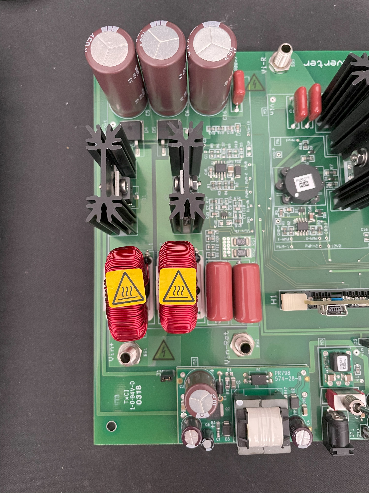
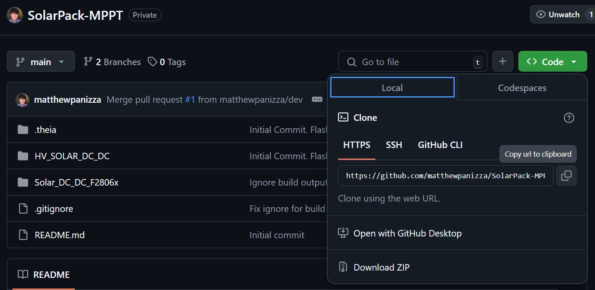
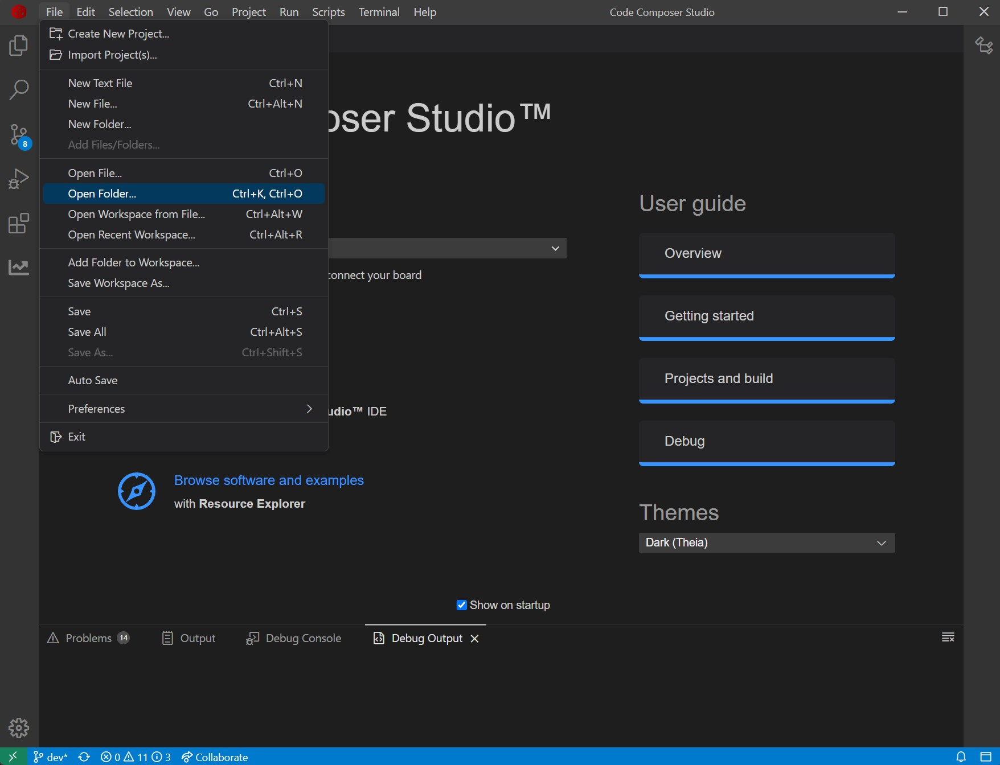

# SolarPack-MPPT
Repository for a Solar Maximum Power Point Tracker boost converter using a TI F28069M-LAUNCHXL. Initially written on 1/18/2025.

## Background
This hardware is designed to take variable input voltage from a solar array and boost it up to a higher voltage for charging a battery. It implements a Maximum Power Point Tracking algorithm that attempts to source the greatest amount of power from the solar array. See the following sections for information about the MPPT:

- [Hardware](#hardware): Information about the PCB and how it works from an electrical engineering perspective.
- [MPPT Software](#mppt-software): Information about how MPPTs work and the software control.
- [Installing the Software](#installing-the-software): How to install the development environment and flash code onto the microcontroller on the MPPT.

**WARNING**: This project has a lot of complicated power electronics and very complicated software. It is recommended that you have taken ECE302 (Advanced Circuits) and ECE306(Embedded Systems) to have the requisite knowledge to understand the components here.

**A MORE SERIOUS WARNING**: This project has a lot of *complicated* power electronics and *very complicated* software! The PCB and software are capable of producing hundreds of volts and could kill you if not handled properly. Capacitors can be overvolted and explode! Please take precautions (place items in enclosures, measure voltage, and don't touch after charging) when handling equipment! Only change things if you know what you are doing!

## Hardware

### Texas Instruments Evaluation Board
We were given an [Evaluation Board](https://www.ti.com/tool/TIDM-SOLAR-DCDC) as a donation from Texas Instruments, which was intended to take 200-300VDC in from a solar array and boost it to 400V at 500W. However, our solar array on the Golf only produces 105V, but at 600W. Some hardware and software modifications were needed to get configuration this functional. We replaced the inductors with the same [Hammond Manufacturing 1539M28 500uH 6.5A](https://www.digikey.com/en/products/detail/hammond-manufacturing/1539M28/455188) inductors used on the [Revision 1](#revision-1-hardware) custom board to improve the boost and power capabilities of TI's board. Below is the unmodified section of their eval board responsible for performing boost conversion:

This PCB's brains is the TI [F28035 Piccolo controlCard](https://www.ti.com/tool/TMDSCNCD28035), a Digital Signal Processing chip from their C2000 series. It came with some evaluation software detailed in the [MPPT Software](#mppt-software) section which we've modified to support our application. The eval board implements a boost conversion circuit with a bit of a twist: it has two "phases" (i.e. two boost converters in parallel) that run 180 degrees out of phase with each other. Not only does this take some of the load off of each phase, it also reduces the ripple current (small fluctuations in current caused by the switching of the MOSFET) from the solar cells. This helps improve the cell power generation efficiency. See the [How this Hardware Works](#how-this-hardware-works) section for the schematic and electrical engineering explanation of how it works.

### Revision 1 Hardware

After the first year at the competition, we found some issues with running the eval board continuously. The gate driver circuit had fried on us during one of the scrutineering days and we had to scramble to get some new parts to get it repaired. Since the design worked as a proof-of-concept, we figured we'd use the same architecture, but just amp up the size of the key components. Below is a picture of the Revision 1 Hardware:

On this revision, we bumped up the specs of the switching MOSFETs and the input and output capacitors. On the eval board, we had to wire up dedicated isolation relays so the battery management system could cut off the power if there was an issue with the HV battery. On this revision, we included these relays, two on each of the input and output. The relays were then controlled from the BMS through the black/white Anderson connector on the left side of the board. Critically, we also needed to upgrate the brains - the F28035 control card uses this special RAM-like slot (like you'd find on a PC) for connecting to the board. We couldn't find these *anywhere*. Instead, we decided to port the code over to run on a newer platform, the LAUNCHXL-F28069M launchpad. This new microcontroller was based on the same C2000 series, which made the port fairly straightforward - it was a matter of pointing to the new F28069 header files.

### How this Hardware Works

The MPPT circuit utilized a standard inductor-based boost conversion technique found in many DC to DC voltage step-up applications. Below is a rough schematic of the boost converter our MPPT uses showing the key components:

The voltage boost works by first turning on the MOSFETs (Q1, Q2) which essentially short-circuits the panel voltage through the inductors. However, current through an inductor cannot change instantly, so the current slowly begins ramping up as the magnetic field in the inductors grow. Then, the MOSFET turns off, but just like before, the current through the inductors cannot change instantly. For this statement to remain true, the current has to keep going through the diodes (D1, D2). On the output, we have a 400V battery, and Vpv is only 100V, so there is a massive voltage generated across the inductors (300V) that allows the current to flow. Eventually, the magnetic field in the inductors dissipate, and no more current flows. This cycle is repeated 100000 times per second on the MPPT to make for a smooth output voltage. The MPPT controller then changes the duty cycle (the percentage of time the MOSFET is on per cycle) in order to control how much power flows.

## MPPT Software

### Power Conversion Software

The MPPT software is designed to handle both boost conversion and the Maximum Power Point Tracking (MPPT) algorithm. The MPPT algorithm works by continuously analyzing the input current and input voltage from the solar array. Solar cells have diode-like I-V curves, and the algorithm attempts to find the point on the curve that results in the greatest amount of power output. Below are the I-V curve and the P-I curve. The example is for a solar cell that has a short circuit current of 1 amp and an open-circuit voltage of 260V. X-axis for both plots is current (in Amps):

#### I-V Curve

#### P-I Curve

Looking at the P-I curve, notice the rapid dropoff of power on the right side of the graph. Solar cells will approach near-zero voltage output if the sourced current increases even a little over the maximum power point. This means the algorithm needs to be cautious to not source too much current. Thankfully, TI has already made a MPPT algorithm that seems to work for our purposes, so this is just a background to help you understand why we have this.

To run the boost and MPPT algorithm, the microcontroller is taking an Analog-to-Digital Conversion (ADC) of the input voltage, input current, and output voltage. This ensures the output voltage has a closed loop to not over-volt.

### Thermistor Temperature Measurement

There are also two headers on this board to read from a NTC thermistor. I had intended these to measure the heatsink and ambient air temperature and cut off power if it got too hot. For the moment, it just reports the data over CAN Bus.

### CAN Bus Telemetry

The TI microcontroller is equipped with an integrated CAN Bus controller, so we are using this to report data to the low voltage system about the power generation of the solar array. The bus runs at 500kbps. On the Revision 1 hardware, there is an issue however. There is not any isolation between the CAN Bus lines and the high voltage ground, so this cannot be connected to the low voltage system without causing potential grounding issues (as the low voltage and high voltage grounds are isolated). This will need to be fixed in the Revision 2 of the MPPT hardware. Will need to find the CAN TX and RX lines, pass them through an isolator chip, and then have a CAN Transceiver to convert to CAN L and H.

### LED Indication

In addition to CAN telemetry, there is also an included RGBW indicator LED. This LED changes color based on the state of the MPPT (idle, error, boosting). It also indicates if the CAN Bus communication is being acknowledged.

- White: Converter is idle. CAN Bus is connected.
- Blue: Converter is idle. CAN Bus is not connected.
- Cyan: Converter is active (boosting). CAN Bus is connected.
- Green: Converter is active (boosting). CAN Bus is not connected.
- Orange: Converter is in an error state. CAN Bus is connected.
- Orange: Converter is in an error state. CAN Bus is not connected.

## Installing the Software

### Application Requirements
- [Code Composer Studio (V20 or greater)](https://www.ti.com/tool/CCSTUDIO): Development Environment for C2000 Microcontrollers from TI
- [Optional] [Git for Windows](https://gitforwindows.org/): Optional for interaction with Git repositories. Get this if you will be making changes to the software/hardware and need to track changes.
- [Optional] [Tortoise Git](https://tortoisegit.org/download/): Optional graphical tool for performing repository actions. Get this if you will be making changes to the software/hardware and need to track changes.

### Installing the Code Composer Studio IDE

Code Composer Studio's latest version at the time of writing is 20.0.1. The project was designed for older versions, but I've ported it to use the latest. The IDE has a base layer of Visual Studio Code but with options for controlling TI's hardware and doing debugging. To install, launch the executable, and choose the default options up until the following page:

I've installed only the following options to save on disk space and was able to flash and debug the controller without any issues. After finishing installation, you can open up the newly installed CCS. You may be prompted to select a directory for a workspace - the default is fine. You'll then be presented with the following main menu:

From here, you'll want to either clone the repository, or just download the zip file from GitHub if you're not planning on making changes to the code.

### Cloning the Repository

If you will be making code changes to the repository, it is recommended that you make a new branch off of `main` (i.e. a `dev` branch) to make your changes. Once changes are committed and pushed, you can then merge them back into main. This ensures that `main` has the latest *working* copy, and any untested code is separate. With TortoiseGit and Git for Windows installed, right click in a directory where you want to download the project. Choose, Git Clone from Tortoise's options and the following menu will pop up. 

For the Repo URL, copy the link using the button on the GitHub repository. If you've made a `dev` branch, chekc the "Branch" box and enter the name of the branch you want to work out of. Click OK, and TortoiseGit should download a copy of the repository.

### Opening the Project

With the project cloned or downloaded as a zip, you'll want to open it from CCS using the `Open Folder` function.

Choose the entire repository folder, not any of the sub-folders. In CCS, the file explorer should show something resembling the following:

The file explorer shows the `MPPT_BETA_F28069` project with a configuration for the Flash. If that's not shown, you may have opened the wrong folder. Now you've successfully opened the projects and can view files to make edits or flash a new device. The main code is held in `HV_Solar_DC_DC-Main.c`, most of the other files are common libraries for operations on the C2000 Microcontrollers and libraries for doing math.

### Flash or Debug the Project

Now that the project has been opened successfully, you can upload new code to the F28069M controller. Connect the device over USB first. Then, to upload the code, right click on the project, `MPPT_BETA_F28069` in my case, and choose either `Flash Project` or `Debug Project`. If you are just trying to upload the code, use `Flash Project`. Debug is if you want to view variables during operation. 

**DANGER**: When debugging, be VERY careful if you set a breakpoint or pause the code in any manner! You may end up in a state where the power conversion mechanism is either short-circuiting the input (which could fry your MOSFETs) or is boosting to the maximum without any load (this could cause a huge voltage spike and violently EXPLODE the capacitors on the output)!

The IDE will show you the following messages to show that it's uploading correctly:

